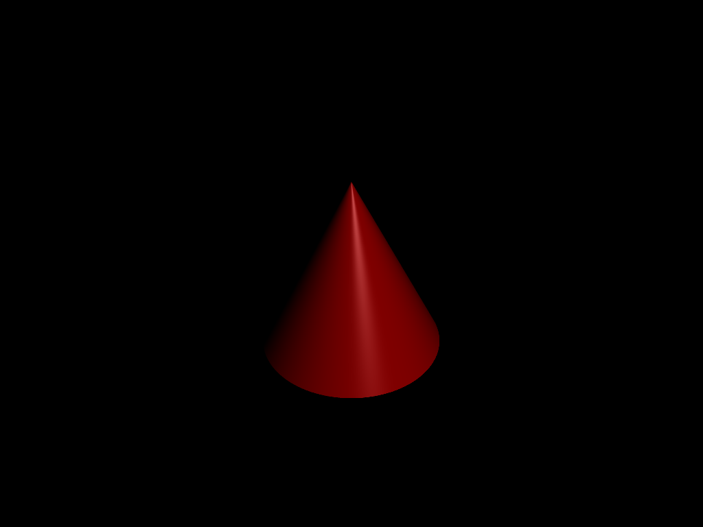
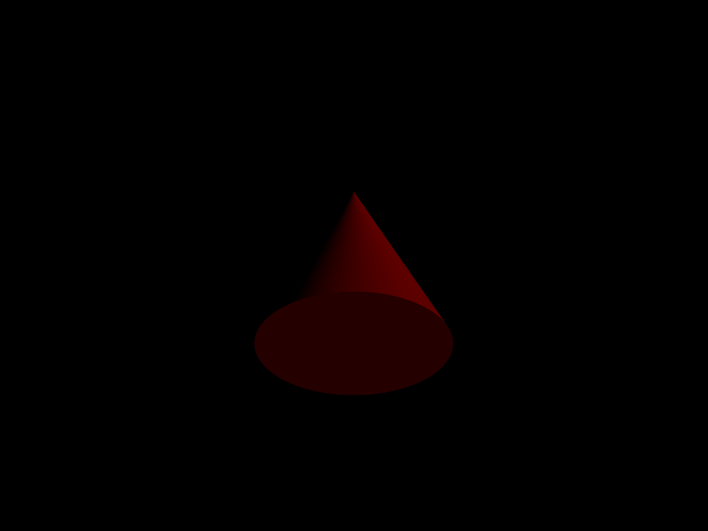
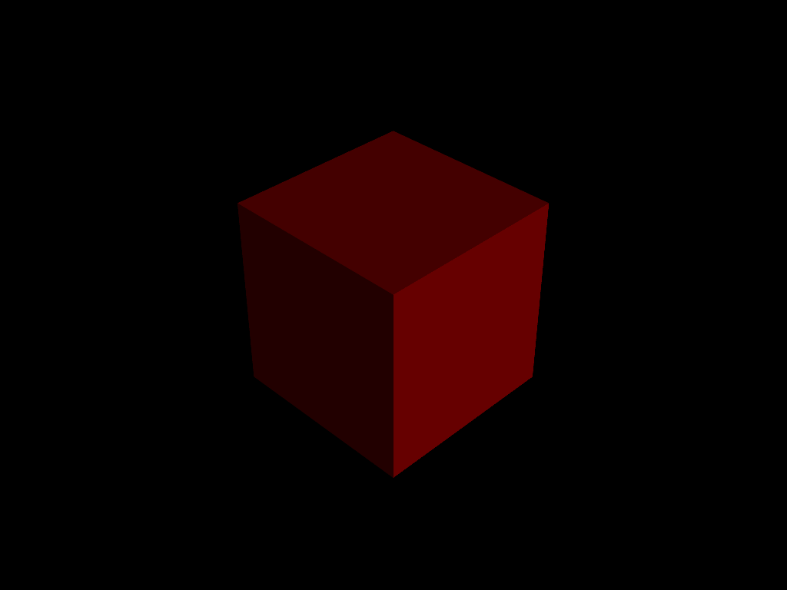
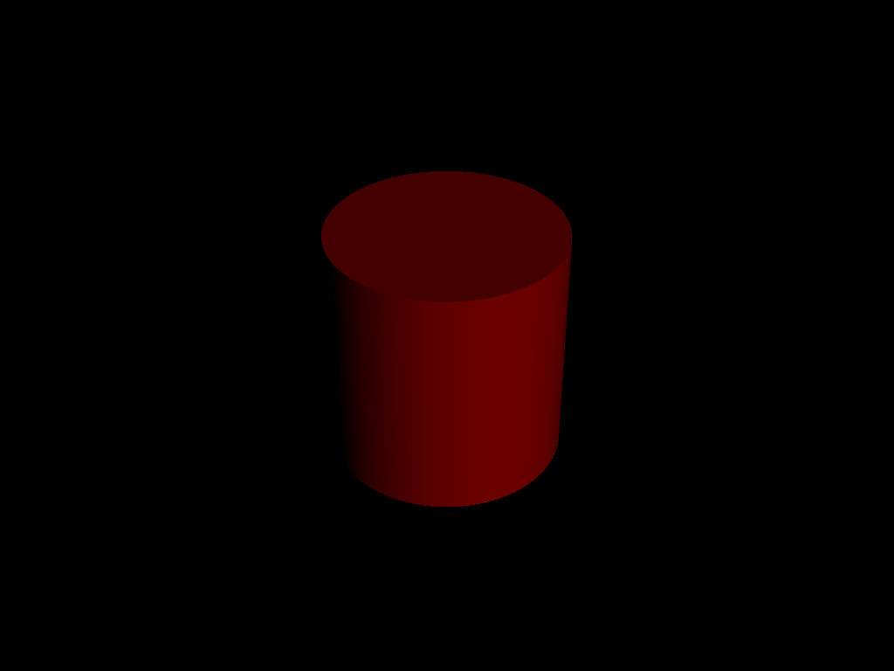
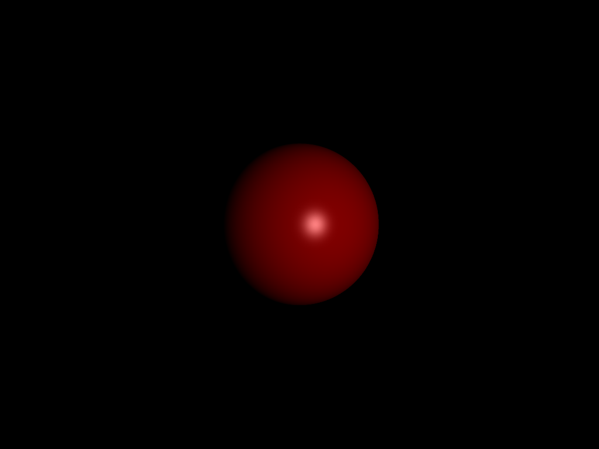
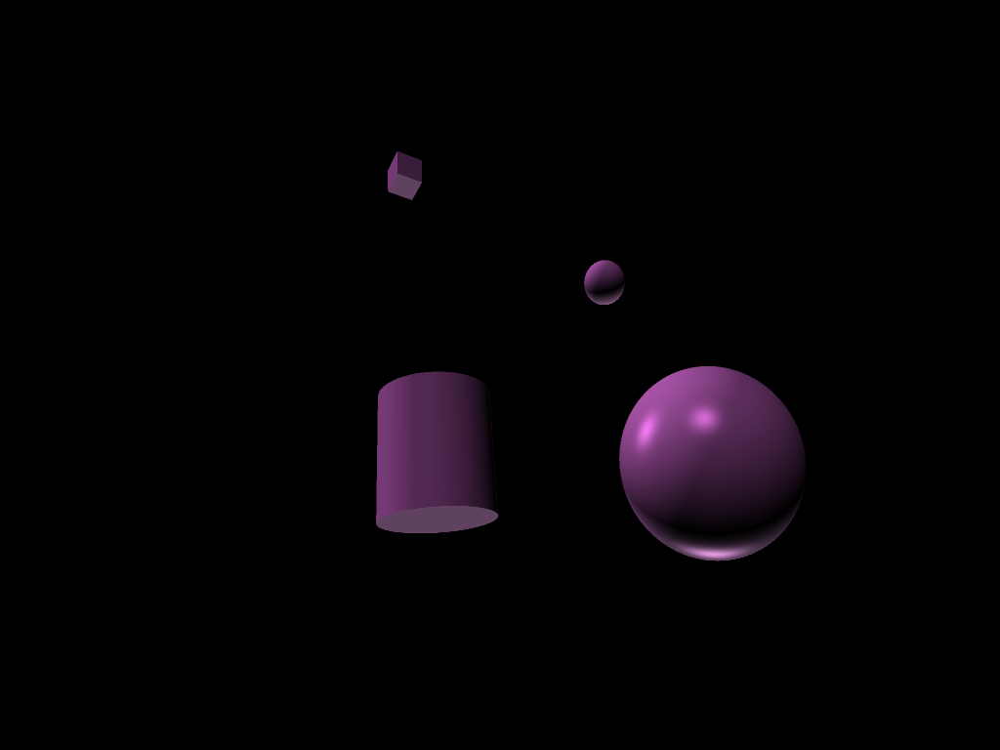
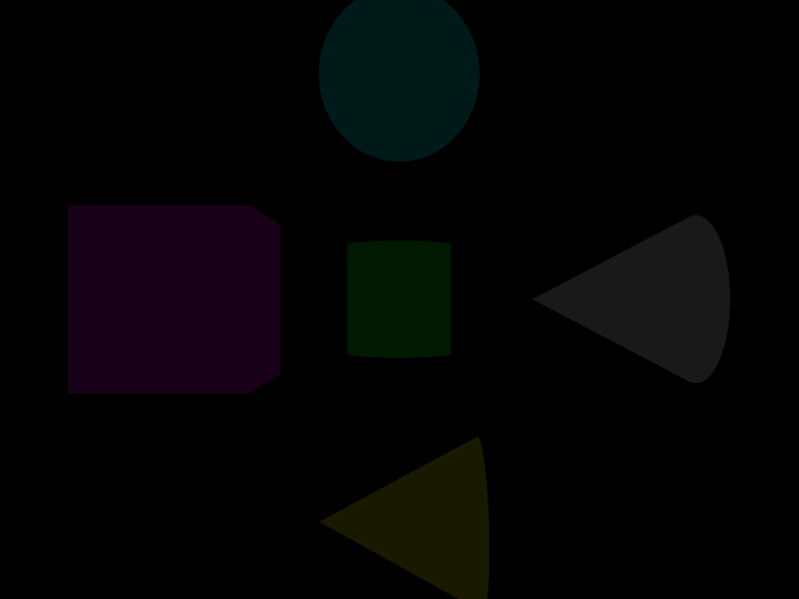
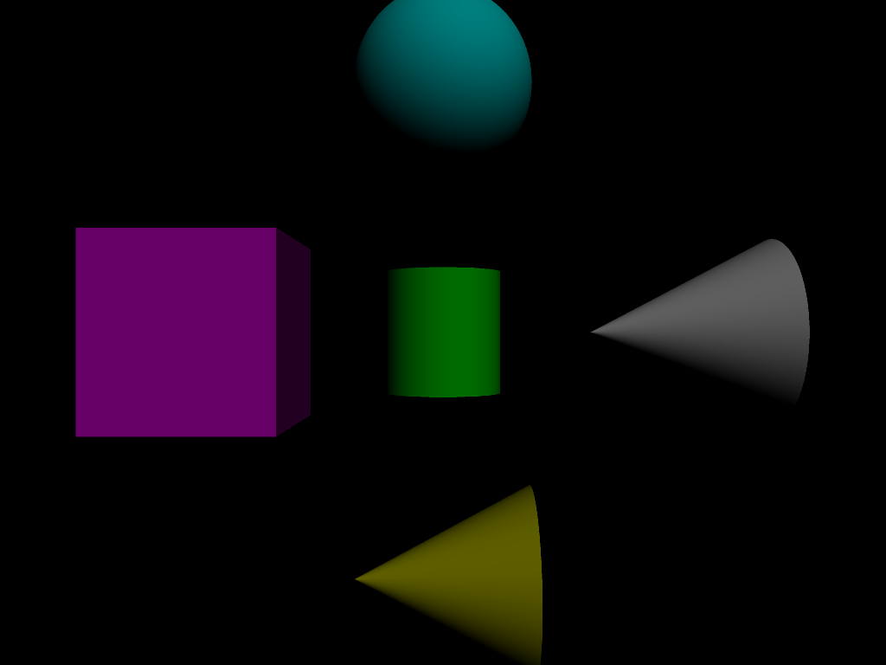
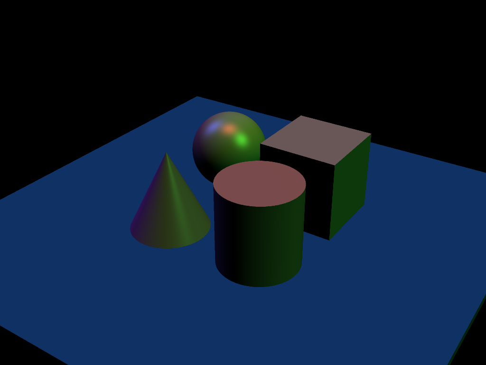

## Project 3: Intersect

Please fill this out for Intersect only. The project handout can be found [here](https://cs1230.graphics/projects/ray/1).

### Output Comparison
Run the program with the specified `.ini` file to compare your output (it should automatically save to the correct path).
> If your program can't find certain files or you aren't seeing your output images appear, make sure to: 
> 1. Set your working directory to the project directory
> 2. Set the command-line argument in Qt Creator to `template_inis/intersect/<ini_file_name>.ini`
> 3. Clone the `scenefiles` submodule. If you forgot to do this when initially cloning this repository, run `git submodule update --init --recursive` in the project directory

> Note: once all images are filled in, the images will be the same size in the expected and student outputs.

**I went through all the steps above and still do not have unit_cone_top.json or unit_cylinder_botton.json in my repository, so I am unable to compile those images**

| File/Method To Produce Output | Expected Output | Your Output |
| :---------------------------------------: | :--------------------------------------------------: | :-------------------------------------------------: |
| unit_cone.ini |   |  |
| unit_cone_cap.ini |  |  |
| unit_cone_top.ini |  |  |
| unit_cube.ini |  |  |
| unit_cylinder.ini |  |  |
| unit_cylinder_bottom.ini |  |  |
| unit_sphere.ini |  |  |
| parse_matrix.ini |  |  |
| ambient_total.ini |  |  |
| diffuse_total.ini |  |  |
| specular_total.ini |  |  |
| phong_total.ini |  |  |
| directional_light_1.ini |  |  |
| directional_light_2.ini |  |  |

### Design Choices

I decided to use polymorphism with this project for the shapes. The shape class has methods like calcNormal, calcIntersection, calcBoundingBox (for KdTree), and others. These methods get called when raytracing on whatever shape we are currently checking against. This was my most significant design choice. Others include delegating helper methods in the ray tracer scene and camera classes, and delegating to a bounding box struct and KdNode struct for my KdTree. I also chose to do adapative super sampling, where I continue sub sampling until the variance of the color in a neighborhood reaches below a certain threshold. 

### Collaboration/References

I used chatGPT for debugging help, although it didn't really do much besides catch low level syntax errors when setting up polymorphism. 

### Known Bugs

I have no known bugs in the basic funtionality of the program. My KdTree works, although does not speed everything up quickly enough as of right now. I was playing with the maxDepth of the recursion to see if that was my issue, but I never got to the bottom of it. It's likely something small, but as of right now my KdTree is setup and integrated with the program, but doesn't speed it up as much as I'd like. 

### Extra Credit

I completed the adaptive super sampling (found in the ray tracer class) and the KdTree (in the KdTree class). To go back to the original version of my project without these features, you can uncomment the method in the raytracer class and comment out everything below it. I have not included images of these features as they produce the same outputs as the normal ray tracer, just with faster speeds or more accuracy. The images generated above were done with the version of my project which implements both these features. 
